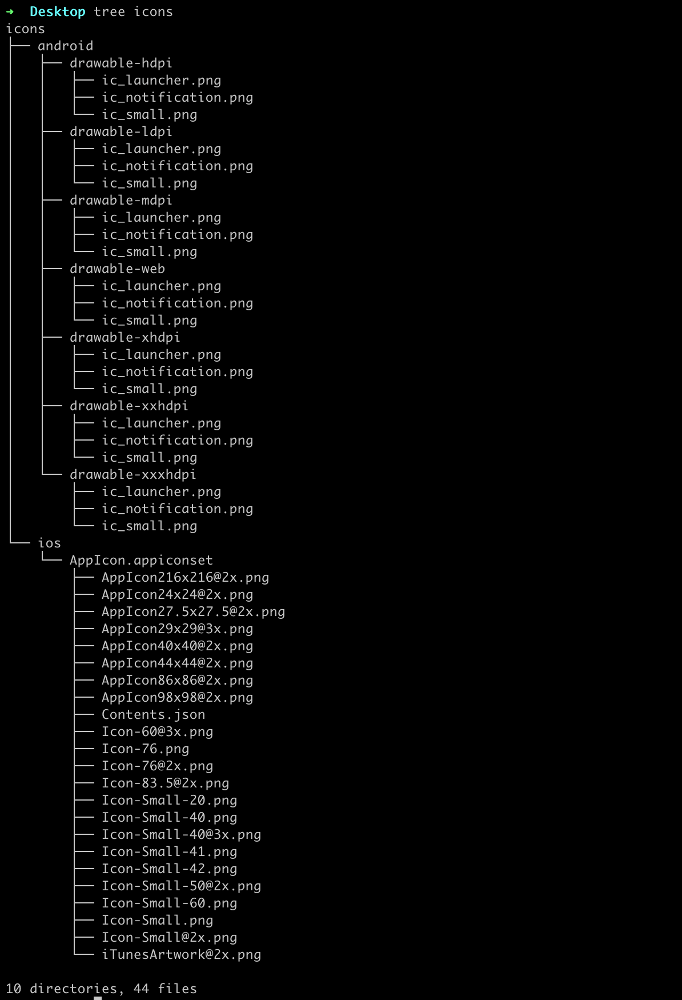

<!---->
<!---->


# AZ App Icon config

[[_TOC_]]

## Install with `pip`

```shell script
pip install appicon
```

## How to use it?

First of all you should be generate icons with `icon_generate` function.

```python
from appicon import icon_generate


icon_generate(logo_path='~/logo.png', destination_directory='~/icons')
```



If you want to move in to `zip` file you can use `to_zip` function, and also you can remove old icon generated or not with `is_remove_source_directory` parameters.

```
from appicon import to_zip


to_zip(source_directory='~/icons', destination_path='~/icons.zip', is_remove_source_directory=True)

```  

## Support

1. iOS

1. Android

# TODO

- [X] Documentation

## Develop

## License

The MIT License (MIT). Please see [License File](LICENSE) for more information.


